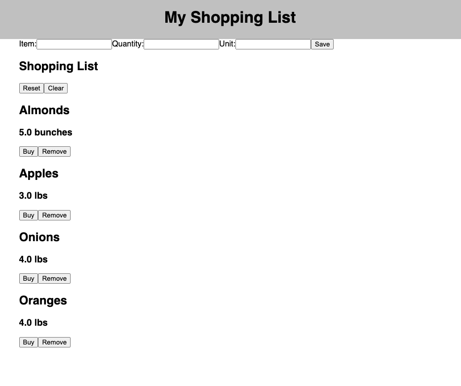

# REACT SHOPPING LIST

## Description

_Duration: 2 Day Project

Have you ever returned from the grocery store realizing that you forgot the most crucial item? Fear not! Our React Shopping List app can help solve that problem! With an easy to use interface, you can keep track of all your shopping needs. 

As a user, you can add all of your items to the list and get as specific as possible. Once you have created your list, you can mark items as purchased similar to crossing off items on a to-do list. And when you are done with your grocery run, you can clear your list to be ready for your next trip! Our app makes is easily accessible through your browser and keep track of your shopping needs efficiently. 

## Screen Shot

### Prerequisites

Link to software that is required to install the app 

- [Node.js](https://nodejs.org/en/)
- [PostgreSQL](https://www.postgresql.org/download/)
- [Postico](https://eggerapps.at/postico/v1.php)

## Installation

1. Create a database named `fs-react-shopping`,
2. The queries in the `database.sql` file are set up to create all the necessary tables and populate the needed data to allow the application to run correctly. The project is built on [Postgres](https://www.postgresql.org/download/), so you will need to make sure to have that installed. We recommend using Postico to run those queries as that was used to create the queries, 
3. Open up your editor of choice and run an `npm install`
4. Run `npm run server` in your terminal
5. Run `npm run client` in your terminal
6. The `npm run client` command will open up a new browser tab for you!

## Usage
How does someone use this application? Tell a user story here.

1. Open localhost
2. The item list will load on viewing. 
3. Enter items, quantity, unit to be added in the form
4. Mark items as purchased
5. Reset to use the same list 
6. Clear to start a new list. 

## Built With

- *SQL
- *Express
- *React
- *Node

## Acknowledgement
Thanks to [Prime Digital Academy](www.primeacademy.io) and Dane for pointing out something no one else could ever figure out. 

## Support
If you have suggestions or issues, please email me at [youremail@whatever.com](www.google.com)